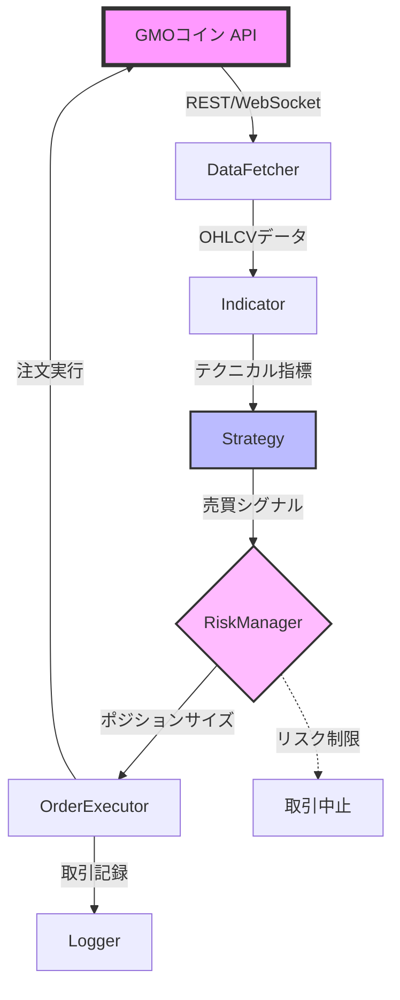

# GMOコイン自動売買システム - アーキテクチャドキュメント

## 目次
1. [システム概要](#システム概要)
2. [ディレクトリ構造](#ディレクトリ構造)
3. [各モジュールの詳細説明](#各モジュールの詳細説明)
   - [ConfigManager](#1-configmanager-backendconfig_manager)
   - [Logger](#2-logger-backendlogger)
   - [DataFetcher](#3-datafetcher-backenddata_fetcher)
   - [Indicator](#4-indicator-backendindicator)
   - [Strategy](#5-strategy-backendstrategy)
   - [RiskManager](#6-riskmanager-backendrisk_manager)
   - [OrderExecutor](#7-orderexecutor-backendorder_executor)
   - [Backtester](#8-backtester-backendbacktester)
   - [Frontend](#9-frontend-frontend)
4. [データフロー](#データフロー)
5. [設定ファイル](#設定ファイル)
6. [実行方法](#実行方法)
7. [開発ガイド](#開発ガイド)
   - [新しい戦略の追加](#新しい戦略の追加)
   - [トラブルシューティング](#トラブルシューティング)

## システム概要

このシステムは、GMOコインのAPIを使用してビットコイン(BTC/JPY)の自動売買を行うPython製のアプリケーションです。

### 主要機能
- **自動売買**: テクニカル指標に基づく24時間自動取引
- **バックテスト**: 過去データを使用した戦略検証
- **Web UI**: Streamlitによる直感的な操作画面
- **リスク管理**: 資金管理、ポジション管理、損切り設定

## ディレクトリ構造

```
C:\AI\自動売買\
│
├── backend/                 # バックエンドの主要モジュール
│   ├── config_manager/      # 設定管理
│   │   ├── __init__.py
│   │   └── config_manager.py    # 設定の読み込み・管理
│   │
│   ├── logger/              # ロギングシステム
│   │   ├── __init__.py
│   │   └── logger.py            # ログ出力・取引記録
│   │
│   ├── data_fetcher/        # データ取得
│   │   ├── __init__.py
│   │   ├── base.py              # 基底クラスとユーティリティ
│   │   ├── rest_api.py          # GMOコイン REST API
│   │   └── websocket_api.py     # GMOコイン WebSocket API
│   │
│   ├── indicator/           # テクニカル指標
│   │   ├── __init__.py
│   │   └── indicator_calculator.py  # 各種指標の計算
│   │
│   ├── strategy/            # 売買戦略
│   │   ├── __init__.py
│   │   ├── base_strategy.py     # 戦略基底クラス
│   │   ├── ma_cross_strategy.py # 移動平均クロス戦略
│   │   ├── macd_rsi_strategy.py # MACD+RSI戦略
│   │   └── strategy_manager.py  # 戦略管理
│   │
│   ├── risk_manager/        # リスク管理
│   │   ├── __init__.py
│   │   └── risk_manager.py      # ポジションサイズ計算、リスク制限
│   │
│   ├── order_executor/      # 注文実行
│   │   ├── __init__.py
│   │   └── order_executor.py    # 注文の発注・管理
│   │
│   └── backtester/          # バックテスト
│       ├── __init__.py
│       └── backtester.py        # バックテストエンジン
│
├── frontend/                # フロントエンド
│   └── app.py                   # Streamlit Web UI
│
├── config/                  # 設定ファイル
│   └── config.yaml              # システム設定
│
├── data/                    # データ保存
│   └── ohlcv/                   # OHLCVデータ（Parquet形式）
│
├── logs/                    # ログファイル
│   ├── system_*.log             # システムログ
│   └── trades/                  # 取引ログ（税務用）
│       └── trades_*.csv         # 日別取引記録
│
├── scripts/                 # ユーティリティスクリプト
│   ├── download_data.py         # 過去データダウンロード
│   ├── setup.sh                 # セットアップ（Linux/Mac）
│   └── setup.bat                # セットアップ（Windows）
│
├── tests/                   # テストコード
│   ├── conftest.py              # pytest設定
│   ├── test_config_manager.py   # ConfigManagerのテスト
│   └── test_strategy.py         # 戦略のテスト
│
├── docker/                  # Docker関連（オプション）
│
├── main.py                  # メインエントリーポイント
├── requirements.txt         # Python依存関係
├── .env.example            # 環境変数のテンプレート
├── .env                    # 環境変数（要作成）
├── .gitignore              # Git除外設定
├── Dockerfile              # Dockerイメージ定義
├── docker-compose.yml      # Docker Compose設定
└── README.md               # プロジェクト説明

```

## 各モジュールの詳細説明

### 1. ConfigManager (`backend/config_manager/`)
**役割**: システム全体の設定を一元管理

- `config_manager.py`: 
  - YAMLファイル（`config/config.yaml`）から設定を読み込み
  - 環境変数（`.env`）から機密情報を読み込み
  - 設定値の検証とアクセス用API提供

**主要クラス・関数**:
- `ConfigManager`: 設定管理クラス
- `get_config_manager()`: シングルトンインスタンス取得
- `get_config(key, default)`: 設定値取得のショートカット

### 2. Logger (`backend/logger/`)
**役割**: システムログと取引記録の管理

- `logger.py`:
  - Loguruを使用した高機能ログシステム
  - ログレベル別の出力制御
  - ファイルローテーション機能
  - 取引記録のCSV出力（税務対応）

**ログの種類**:
- システムログ: `logs/system_YYYY-MM-DD.log`
- 取引ログ: `logs/trades/trades_YYYYMMDD.csv`

### 3. DataFetcher (`backend/data_fetcher/`)
**役割**: GMOコインAPIからのデータ取得

- `base.py`: 基底クラス、レート制限、データ検証、ストレージ管理
- `rest_api.py`: REST APIクライアント
  - OHLCVデータ取得
  - 口座情報・残高取得
  - 注文発注
- `websocket_api.py`: WebSocketクライアント
  - リアルタイム価格情報
  - 板情報の受信
  - 約定通知

**データ保存**:
- OHLCVデータ: `data/ohlcv/BTC_JPY_1hour.parquet`

### 4. Indicator (`backend/indicator/`)
**役割**: テクニカル指標の計算

- `indicator_calculator.py`:
  - pandas_taライブラリを使用
  - 対応指標: SMA, EMA, MACD, RSI, ボリンジャーバンド, ATR等
  - カスタム指標の追加が容易

### 5. Strategy (`backend/strategy/`)
**役割**: 売買戦略の実装と管理

- `base_strategy.py`: すべての戦略の基底クラス
- `ma_cross_strategy.py`: 移動平均クロス戦略
  - 短期・長期移動平均のゴールデンクロス/デッドクロス
- `macd_rsi_strategy.py`: MACD+RSI複合戦略
  - RSIの過熱感とMACDのモメンタムを組み合わせ
- `strategy_manager.py`: 戦略の登録・切り替え管理

**シグナルタイプ**:
- `BUY`: 買いエントリー
- `SELL`: 売りエントリー
- `CLOSE_LONG`: ロングポジションクローズ
- `CLOSE_SHORT`: ショートポジションクローズ
- `HOLD`: 何もしない

### 6. RiskManager (`backend/risk_manager/`)
**役割**: リスク管理と資金管理

- `risk_manager.py`:
  - ポジションサイズ計算（固定率、ケリー基準）
  - ストップロス/テイクプロフィット価格計算
  - リスク制限チェック（最大ポジション数、最大ドローダウン等）
  - ポートフォリオメトリクス計算

### 7. OrderExecutor (`backend/order_executor/`)
**役割**: 注文の実行と管理

- `order_executor.py`:
  - シグナルに基づく注文発注
  - 注文状態の追跡
  - 約定確認と記録
  - 注文キャンセル機能

### 8. Backtester (`backend/backtester/`)
**役割**: 戦略のバックテスト

- `backtester.py`:
  - 過去データでの戦略シミュレーション
  - 手数料・スリッページの考慮
  - パフォーマンス指標の計算
  - 結果の可視化用データ生成

**計算指標**:
- 総リターン、勝率、プロフィットファクター
- 最大ドローダウン、シャープレシオ
- 平均勝ち/負けトレード

### 9. Frontend (`frontend/`)
**役割**: Web UI

- `app.py`: Streamlitアプリケーション
  - バックテスト画面: 戦略検証
  - リアルタイムダッシュボード: 運用監視
  - システムコントロール: 起動/停止

## データフロー

### 1. リアルタイム取引フロー



※ バグ調査時はこのフローを見て、どこで問題が起きているか特定する

### 2. バックテストフロー
```
過去データ (data/ohlcv/)
    ↓
Backtester
    ├→ Indicator (指標計算)
    ├→ Strategy (シグナル生成)
    ├→ RiskManager (リスク計算)
    └→ 結果集計
         ↓
    Frontend (結果表示)
```

## 設定ファイル

### 1. `config/config.yaml`
システム全体の設定を定義:
- **system**: システム基本情報
- **exchange**: 取引所接続情報
- **trading**: 取引パラメータ
- **data_fetcher**: データ取得設定
- **indicators**: テクニカル指標設定
- **strategies**: 戦略設定とパラメータ
- **risk_management**: リスク管理設定
- **backtest**: バックテスト設定
- **logging**: ログ設定
- **notifications**: 通知設定（Slack等）
- **ui**: UI設定

### 2. `.env`
機密情報を保存（環境別に設定）:

**開発環境用 (`.env.development`)**:
```
GMO_API_KEY=your_test_api_key
GMO_API_SECRET=your_test_api_secret
ENV=development
DEBUG=True
LOG_LEVEL=DEBUG
PAPER_TRADE=True
```

**本番環境用 (`.env.production`)**:
```
GMO_API_KEY=your_production_api_key
GMO_API_SECRET=your_production_api_secret
ENV=production
DEBUG=False
LOG_LEVEL=INFO
PAPER_TRADE=False
```

**セキュリティのベストプラクティス**:
- 本番環境では**必ず**`DEBUG=False`に設定
- 開発用と本番用でAPIキーを分離
- `.env`ファイルは`.gitignore`に追加してバージョン管理から除外

## 実行方法

### 1. 初期セットアップ
```bash
# Windows
scripts\setup.bat

# Linux/Mac
bash scripts/setup.sh
```

### 2. UI起動（推奨）
```bash
python main.py --mode ui
```
ブラウザで http://localhost:8501 にアクセス

### 3. ボットのみ起動
```bash
python main.py --mode bot
```

### 4. Docker使用
```bash
docker-compose up -d
```

### 5. データダウンロード
```bash
python scripts/download_data.py --symbol BTC_JPY --interval 1hour --days 30
```

## 開発ガイド

### 新しい戦略の追加

1. `backend/strategy/`に新しいファイルを作成
2. `BaseStrategy`クラスを継承
3. `generate_signal()`メソッドを実装
4. `strategy_manager.py`に登録

```python
from backend.strategy import BaseStrategy, Signal

class MyNewStrategy(BaseStrategy):
    def generate_signal(self, df, current_position, account_info):
        # 戦略ロジックを実装
        return signal, details
```

### テストの実行
```bash
pytest tests/
```

### ログの確認
- システムログ: `logs/system_*.log`
- 取引ログ: `logs/trades/trades_*.csv`

### トラブルシューティング

**Q: APIキーエラーが出る**
A: `.env`ファイルが正しく設定されているか確認

**Q: データが取得できない**
A: 
- インターネット接続を確認
- GMOコインのAPIステータスを確認
- `logs/`のエラーログを確認

**Q: バックテストが遅い**
A: 
- データ期間を短くする
- より大きい時間間隔（1hour→1day）を使用

### 注意事項
- 本番環境では必ず少額でテストしてから運用
- APIキーは絶対に公開しない
- 定期的にログをバックアップ（特に取引ログ）
- システムアップデート前はバックアップを取る

## 🚨 重要な警告：バックテスト結果の解釈

### 1. **リターンだけで判断するな！**
- シャープレシオ（リスク調整後リターン）が0.5未満の戦略は危険
- 最大ドローダウンが30%を超える場合、精神的に耐えられない可能性大

### 2. **Buy & Holdに負ける戦略は無意味**
- 「ただBTCを買って持つ」よりパフォーマンスが悪いなら、その戦略は失敗
- 手数料やリスクを考慮すると、単純保有の方が優れていることが多い

### 3. **過剰適合（カーブフィッティング）の兆候**
- 勝率80%以上は「ファンタジー」の可能性大
- 取引数が少ない（30回未満）場合、統計的に信頼できない
- パラメータ数が多いAIモデルは特に注意

### 4. **手数料の影響を軽視するな**
- 高頻度取引（HFT）はバックテストでは再現不可能な要因が多い
- 手数料が利益の30%以上を占める場合は要注意

### 5. **メンタル面の考慮**
- 10連敗以上の可能性がある戦略は精神的に厳しい
- 最大ドローダウン期間が長い場合、忍耐できるか真剣に考える
